# 🌐 Deploying an End-to-End Website on AWS
> **Intern-Friendly Guide** | DevOps & Cloud Infrastructure Management
---

## 🗺️ Architecture Diagram

> The diagram below shows how all AWS services connect inside a VPC. Public-facing services live in the public subnet; the database is locked away in a private subnet.



**Key:**
- `──►` Normal traffic flow
- `- - ►` DNS resolution / TLS handshake
- `EC2 ◄──► RDS` Internal database calls (never exposed to the internet)

---

## 🔄 Request Flow Diagram

> This diagram shows exactly what happens, step by step, when a user visits your website.



> 💡 **Key Insight for Interns:** Notice that the database (RDS) is NEVER directly reachable from the internet. The user's request only ever touches EC2. EC2 then talks to RDS privately inside the VPC. This is the foundation of secure cloud architecture.

---

## 📚 Concepts You Should Know First

Before jumping in, here are the key AWS services used in this project:

| Service | What It Does | Analogy |
|---|---|---|
| **Route 53** | Translates domain names to IP addresses (DNS) | Like a phone book for the internet |
| **EC2** | A virtual computer/server you rent from AWS | Like renting a laptop in the cloud |
| **RDS** | Managed database service (MySQL, PostgreSQL, etc.) | Like a filing cabinet that AWS manages for you |
| **Security Groups** | Firewall rules that control traffic to/from your resources | Like a bouncer at the door |
| **VPC** | Your private network inside AWS | Like a private office building inside AWS |
| **Internet Gateway** | Connects your VPC to the public internet | Like the front door of your office building |
| **WAF** | Web Application Firewall — blocks malicious traffic | Like a security scanner at the door |
| **ACM** | AWS Certificate Manager — free SSL/TLS certs | Like an ID badge for HTTPS encryption |

---

## ✅ Prerequisites

Make sure you have these before starting:

- [ ] An **AWS account** ([sign up free](https://aws.amazon.com/free/))
- [ ] **AWS CLI** installed and configured (`aws configure`)
- [ ] A **free domain** from [Freenom](https://www.freenom.com) (e.g., `aws-project.tk`) or any registrar
- [ ] Basic knowledge of **Linux terminal commands** (SSH, `cd`, `ls`, etc.)
- [ ] An **SSH key pair** (created in Step 2 below)

---

## 🏗️ Step-by-Step Deployment

### Step 1 — Set Up Your VPC & Networking

Your VPC is your isolated network inside AWS. Think of it as your own private data center.

```
VPC: 10.0.0.0/16
 ├── Public Subnet: 10.0.1.0/24  ← EC2 lives here (accessible from internet)
 └── Private Subnet: 10.0.2.0/24 ← RDS lives here (NOT accessible from internet)
```

> 💡 **Intern Tip:** Always put your database in a **private subnet**. It should never be directly exposed to the internet. Only your EC2 server should be able to talk to it.

1. Go to **AWS Console → VPC → Create VPC**
2. Name it: `my-project-vpc`, CIDR: `10.0.0.0/16`
3. Create two subnets (one public, one private)
4. Attach an **Internet Gateway** to the public subnet

---

### Step 2 — Launch Your EC2 Instance (Web Server)

1. Go to **AWS Console → EC2 → Launch Instance**
2. OS: **Amazon Linux 2** or **Ubuntu 22.04 LTS**
3. Instance type: `t2.micro` ✅ free tier
4. Place it in your **Public Subnet**
5. Create a **Key Pair** — save the `.pem` file!
6. Security Group (firewall):

```
Inbound Rules:
┌──────────┬──────────┬──────────────────────┬─────────────────────────┐
│ Type     │ Port     │ Source               │ Purpose                 │
├──────────┼──────────┼──────────────────────┼─────────────────────────┤
│ SSH      │ 22       │ Your IP only         │ Remote terminal access  │
│ HTTP     │ 80       │ 0.0.0.0/0 (anyone)   │ Web traffic             │
│ HTTPS    │ 443      │ 0.0.0.0/0 (anyone)   │ Secure web traffic      │
└──────────┴──────────┴──────────────────────┴─────────────────────────┘
```

> ⚠️ **Never open SSH (port 22) to `0.0.0.0/0`.** Always restrict it to your IP only.

```bash
# SSH into your EC2
chmod 400 your-key.pem
ssh -i "your-key.pem" ec2-user@<YOUR_EC2_PUBLIC_IP>

# Install Apache web server
sudo yum update -y
sudo yum install -y httpd
sudo systemctl start httpd
sudo systemctl enable httpd
```

---

### Step 3 — Set Up Amazon RDS (Database)

1. Go to **AWS Console → RDS → Create Database**
2. Engine: `MySQL 8.0` or `PostgreSQL 14`, Template: `Free Tier`
3. DB Identifier: `my-project-db`, Username: `admin`
4. Instance: `db.t2.micro`, VPC: your `my-project-vpc`
5. Subnet Group: **Private subnet only**
6. Public Access: ❌ **NO**

```
RDS Security Group Inbound:
┌──────────┬──────────┬──────────────────────────┬──────────────────────────┐
│ Type     │ Port     │ Source                   │ Purpose                  │
├──────────┼──────────┼──────────────────────────┼──────────────────────────┤
│ MySQL    │ 3306     │ EC2 Security Group only  │ Only EC2 can reach DB    │
└──────────┴──────────┴──────────────────────────┴──────────────────────────┘
```

```bash
# From inside EC2 — connect to your database
sudo yum install -y mysql
mysql -h <YOUR_RDS_ENDPOINT> -u admin -p
SHOW DATABASES;
```

> 💡 Your RDS endpoint looks like: `my-project-db.abc123.us-east-1.rds.amazonaws.com`

---

### Step 4 — Configure Route 53 (DNS)

1. **AWS Console → Route 53 → Create Hosted Zone**
   - Domain: `aws-project.tk`, Type: `Public hosted zone`
2. Copy the **4 NS (Name Server) records** Route 53 gives you
3. Go to your **domain registrar** (Freenom) → update nameservers to those 4 values
4. In your Hosted Zone → **Create Record**:
   - Type: `A`, Name: `www`, Value: `<EC2 Public IP>`, TTL: `300`

```
www.aws-project.tk  →  A Record  →  <EC2 Public IP>
```

> ⏱️ DNS can take up to 48 hours to propagate, but usually 5–15 min. Check with:
> ```bash
> nslookup www.aws-project.tk
> ```

---

## 🔐 Security Checklist

> The diagram below shows all 4 security layers between EC2 and RDS — VPC isolation, security groups, port rules, and SSL/TLS encryption.


- [ ] RDS is in a **private subnet** (no public access)
- [ ] SSH port 22 is restricted to **your IP only**
- [ ] EC2 and RDS have **separate security groups**
- [ ] DB credentials stored in **AWS Secrets Manager** — never hardcoded
- [ ] EC2 uses an **IAM Role** (not hardcoded AWS access keys)
- [ ] RDS **automated backups** are enabled
- [ ] **Termination protection** ON for production RDS

---

## 🛠️ Useful Commands Cheat Sheet

```bash
# SSH into EC2
ssh -i "your-key.pem" ec2-user@<EC2_PUBLIC_IP>

# Check web server status
sudo systemctl status httpd

# View web server logs
sudo tail -f /var/log/httpd/access_log
sudo tail -f /var/log/httpd/error_log

# Check what's listening on port 80
sudo ss -tlnp | grep :80

# Connect to RDS from EC2
mysql -h <RDS_ENDPOINT> -u admin -p

# Verify DNS resolution
nslookup www.aws-project.tk 8.8.8.8

# Test HTTP response
curl -I http://www.aws-project.tk
```

---

## 💸 Cost Awareness (Free Tier)

| Service | Free Tier Limit | Cost After Free Tier |
|---|---|---|
| EC2 `t2.micro` | 750 hrs/month (12 months) | ~$8–10/month |
| RDS `db.t2.micro` | 750 hrs/month (12 months) | ~$15–25/month |
| Route 53 Hosted Zone | — | $0.50/month |
| Data Transfer | 1 GB/month free | Varies |

> ⚠️ Set up a **Billing Alert** in AWS to get notified if costs exceed $5/month. Always **stop/terminate** resources when not in use.

---

## 🧹 Cleanup (Teardown)

```bash
# Terminate EC2
aws ec2 terminate-instances --instance-ids <INSTANCE_ID>

# Delete RDS
aws rds delete-db-instance \
  --db-instance-identifier my-project-db \
  --skip-final-snapshot

# Delete Route 53 Hosted Zone
aws route53 delete-hosted-zone --id <HOSTED_ZONE_ID>
```

---

## 🙋 Common Issues & Fixes

**Can't SSH into EC2?**
- Port 22 Security Group must allow **your current IP** only
- Verify: `chmod 400 your-key.pem`
- EC2 must be in a **public subnet** with an **Internet Gateway**

**Website not loading after DNS change?**
- Wait 5–30 minutes for DNS propagation
- Run `nslookup www.aws-project.tk` to verify it resolves to your EC2 IP
- Check port 80/443 is open in EC2 Security Group

**EC2 can't connect to RDS?**
- Both must be in the **same VPC**
- RDS Security Group must allow port 3306 from the **EC2 Security Group**
- Use the **RDS endpoint URL**, not an IP address

---

## 📖 Learning Resources

| Resource | Link |
|---|---|
| AWS Free Tier | https://aws.amazon.com/free |
| EC2 Getting Started | https://docs.aws.amazon.com/AWSEC2/latest/UserGuide/EC2_GetStarted.html |
| RDS Getting Started | https://docs.aws.amazon.com/AmazonRDS/latest/UserGuide/CHAP_GettingStarted.html |
| Route 53 Docs | https://docs.aws.amazon.com/Route53/latest/DeveloperGuide/getting-started.html |
| AWS Well-Architected | https://aws.amazon.com/architecture/well-architected/ |
| Linux SSH Basics | https://linuxize.com/post/how-to-use-ssh-to-connect-to-a-remote-server/ |
